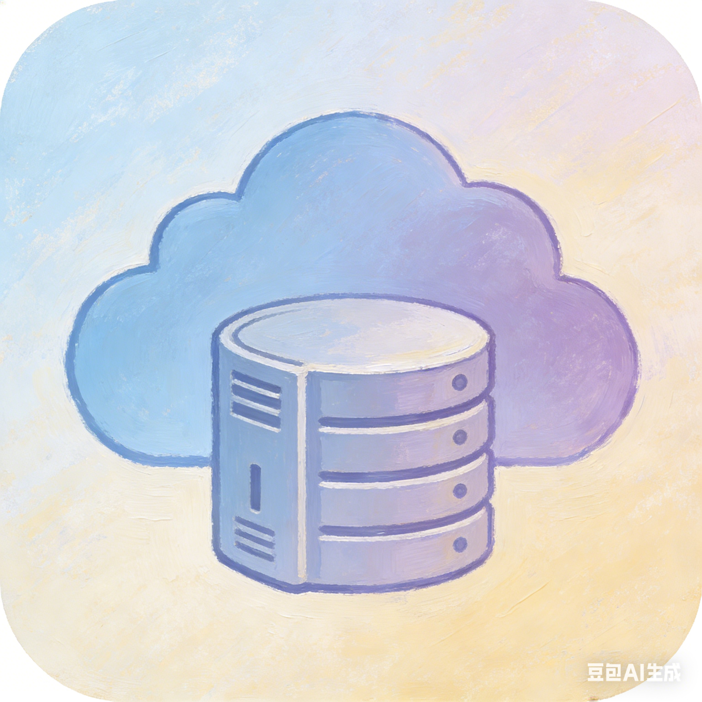

# RockZeroOS UI
<p align="center">
  
</p>

<p align="center">
  <strong>Flutter 跨平台客户端 — Material Design 3 安全私有云 NAS 界面</strong>
</p>

<p align="center">
  <a href="https://flutter.dev/"></a>
  <a href="https://dart.dev/"></a>
  <a href="../LICENSE"></a>
</p>

---

## 概述

RockZeroOS UI 是 RockZeroOS 私有云 NAS 操作系统的跨平台客户端，支持 Android、Windows、Linux 和 Web。使用 Flutter + Riverpod 构建，采用 Material Design 3 设计规范，支持动态主题、毛玻璃效果、全面屏手势导航。

## 功能特性

### 核心功能
- **仪表盘** — CPU、内存、磁盘、网络实时监控，计时器风格速度测试
- **文件管理** — 磁盘浏览、目录导航、文件上传/下载、LAN 文件传输
- **视频播放** — SAE 加密 HLS 流媒体，media_kit (libmpv) 硬件加速解码，`SizedBox.expand()` 确保全平台正确显示
- **音频播放** — `just_audio` 三级回退音频源策略，支持自动服务器端转码（15+ 不支持的编码格式自动转为 AAC/MP3）
- **游戏中心** — 多平台游戏商城（Steam/Epic/WeGame/Ubisoft/Xbox），从官方 API 实时获取数据，支持游戏收藏和统一库
- **WASM 应用** — 内置 SteamDB 查看器、M3U8 视频下载器、Steam P2P 连接分析
- **存储管理** — 智能格式化、自动挂载、分区管理、SMART 监控、安全擦除
- **应用商店** — Docker 应用安装和管理

### 安全认证
- **JWT 认证** — EdDSA (Ed25519) + BLAKE3 签名
- **SAE 密钥交换** — WPA3 Dragonfly (Curve25519) 完整实现
- **零知识证明** — Bulletproofs RangeProof 登录验证
- **FIDO2/WebAuthn** — 支持 YubiKey、TouchID、FaceID、Windows Hello
- **安全存储** — `flutter_secure_storage` 凭证加密

### UI/UX
- **Material Design 3** — 完整 MD3 设计规范，动态主题色
- **动态壁纸** — 自定义壁纸 + 80%壁纸色/20%系统色混合
- **毛玻璃卡片** — `BackdropFilter` 高对比度磨砂效果 (sigma 20)
- **全面屏** — 透明状态栏/导航栏，手势导航，预测返回
- **Expressive 动画** — `flutter_animate` 精细过渡动画

## 架构

```
lib/
├── core/
│   ├── models/           # API 数据模型 (DiskInfo, MediaInfo, etc.)
│   ├── network/          # API 服务层 (Dio HTTP 客户端, 请求/响应拦截)
│   ├── services/         # 壁纸服务, media_kit 初始化, 动态配色
│   ├── theme/            # M3 主题, 动态色彩, 动画曲线
│   └── widgets/          # 通用组件 (ShellScaffold, GlassmorphicCard, DynamicColorCard)
├── features/
│   ├── auth/             # 登录/注册 (毛玻璃卡片, SAE+JWT+ZKP)
│   ├── dashboard/        # 仪表盘, 网速测试 (计时器 UI)
│   ├── files/            # 文件浏览器
│   │   └── presentation/pages/
│   │       ├── files_page.dart                    # 磁盘网格 + 文件列表
│   │       ├── enhanced_media_player_page.dart    # 视频播放器 (media_kit + hwdec)
│   │       └── enhanced_audio_player_page.dart    # 音频播放器 (三级回退)
│   ├── appstore/         # 游戏中心
│   │   └── presentation/
│   │       ├── pages/wasm_store_page.dart          # 多平台游戏商城主页
│   │       └── widgets/platform_game_tab.dart      # 平台游戏标签页 (官方 API 数据)
│   ├── device_discovery/ # mDNS 设备自动发现
│   ├── disk/             # 磁盘格式化与管理
│   ├── storage/          # 存储概览
│   ├── system/           # 系统监控 (CPU/内存/磁盘/USB/内核/运行时间)
│   └── settings/         # 设置 (壁纸/模糊/主题)
└── services/
    ├── sae_client_curve25519.dart    # SAE Dragonfly 客户端实现
    └── sae_handshake_service.dart    # SAE 握手编排
```

## 游戏中心平台集成

每个平台标签页通过后端代理从**官方 API** 获取实时游戏数据：

| 平台 | 官方 API 来源 | 数据内容 |
|------|---------------|----------|
| Epic Games | Epic GraphQL API (`graphql.epicgames.com`) | 游戏名称、描述、价格、封面图、类型标签 |
| WeGame | WeGame API (`wegame.com.cn/api/v1/`) | 游戏列表、热门排行、封面图 |
| Ubisoft | Ubisoft Store API + Ubisoft Services API | 游戏目录、价格、封面图 |
| Xbox | Game Pass 目录 + Microsoft DisplayCatalog API | Game Pass 游戏、封面图、价格 |

- 实时数据显示 🔴 实时 标志
- 封面图从官方 CDN 加载
- 30 分钟服务端缓存
- API 不可达时自动降级为内置目录数据

## 视频/音频播放

### 视频
- 使用 `media_kit` (libmpv) 硬件加速解码
- `SizedBox.expand()` 包裹确保视频画面正确显示
- mpv 配置: `hwdec=auto-safe`, `cache=yes`, `demuxer-max-bytes=50MiB`
- Android: MediaCodec, iOS: VideoToolbox, Desktop: 自动检测

### 音频
- 使用 `just_audio` 播放
- **三级回退策略**: LockCachingAudioSource → AudioSource.uri → setUrl
- 每级 20 秒超时，失败自动切换下一级
- 15+ 不支持的编码格式 (wmav1/2, wmalossless, pcm_bluray, cook, atrac3, ape 等) 由服务端自动转码

### 音频小窗与后台播放行为（生产策略）

- 从小窗恢复到大播放器时，会先停止全局小窗服务再初始化页面播放器，避免“双音轨并发播放”。
- 点击“后台播放”时，页面播放器先暂停/停止，再把位置、音量、速度、循环状态转移给全局 `AudioPlayerService`，随后关闭页面。
- 普通返回（未启用后台播放）会强制停止页面播放器和全局小窗服务，确保退出即停播。
- Mini Audio Player 进入大播放器使用 MD3 风格强调曲线过渡（短时淡入+轻微位移），降低跳变感。

### 全面屏手势适配

- 视频/媒体全屏页面统一使用 `SystemUiMode.edgeToEdge` + `SystemUiOverlay.values`，保留 Android 全面屏手势（包括返回手势）。
- 退出全屏时恢复系统栏与方向策略，避免手势区域被沉浸模式吞噬。

## 运行

```bash
# 获取依赖
flutter pub get

# 运行 (选择平台)
flutter run -d windows
flutter run -d linux
flutter run -d android
flutter run -d chrome
```

## 构建

```bash
# Android APK (ARM64 目标)
flutter clean
flutter build apk --release --target-platform android-arm64

# 安装到设备
adb install build/app/outputs/flutter-apk/app-release.apk

# Windows
flutter build windows --release

# Linux
flutter build linux --release

# Web
flutter build web --release
```

## API 对接

所有 API 端点与 Rust 后端完全对齐：

| 模块 | 端点前缀 | 说明 |
|------|----------|------|
| 认证 | `/api/v1/auth/*` | 注册、登录、JWT 刷新、ZKP 登录 |
| 文件管理 | `/api/v1/filemanager/*` | 文件 CRUD、上传、下载、媒体预览 |
| 流媒体 | `/api/v1/streaming/*` | 媒体信息、缩略图、HLS 播放列表、音频转码 |
| 安全 HLS | `/api/v1/secure-hls/*` | SAE 握手、会话创建、加密 HLS 流 |
| 系统 | `/api/v1/system/*` | CPU、内存、磁盘、USB、硬件信息 |
| 存储 | `/api/v1/storage/*` | 磁盘列表、格式化、挂载 |
| 存储管理 | `/api/v1/storage-management/*` | 高级存储操作、SMART、安全擦除 |
| 应用商店 | `/api/v1/appstore/*` | Docker 应用管理 |
| WASM 商店 | `/api/v1/wasm-store/*` | 游戏中心、WASM 应用、Steam/Epic API |
| 游戏平台 | `/api/v1/wasm-store/platform/games` | Epic/WeGame/Ubisoft/Xbox 官方 API 数据 |
| FIDO2 | `/api/v1/fido/*` | WebAuthn 注册/验证 |
| 速度测试 | `/api/v1/speedtest/*` | 下载/上传/延迟测试 |
| 邀请 | `/api/v1/invite/*` | 邀请码创建/验证 |
| ZKP | `/api/v1/zkp/*` | 零知识证明操作 |

## 主要依赖

| 依赖 | 版本 | 用途 |
|------|------|------|
| flutter_riverpod | 3.0.3 | 状态管理 |
| go_router | 17.0.1 | 路由导航 |
| media_kit | 1.2.6 | 视频播放 (libmpv) |
| just_audio | 0.10.5 | 音频播放 |
| dio | 5.8.0 | HTTP 客户端 |
| flutter_animate | 4.5.2 | 动画效果 |
| flutter_secure_storage | 10.0.0 | 安全凭证存储 |
| pointycastle + edwards25519 | — | SAE/Ed25519 加密 |
| webview_flutter | 4.10.0 | 内嵌浏览器 |
| window_manager | 0.5.1 | 桌面窗口管理 |

## 代码质量

```bash
# 静态分析
dart analyze

# 格式化
dart format lib/

# 运行测试
flutter test
```

## License

**GNU Affero General Public License v3.0 (AGPL-3.0)**

See [LICENSE](../LICENSE) for the full license text.
